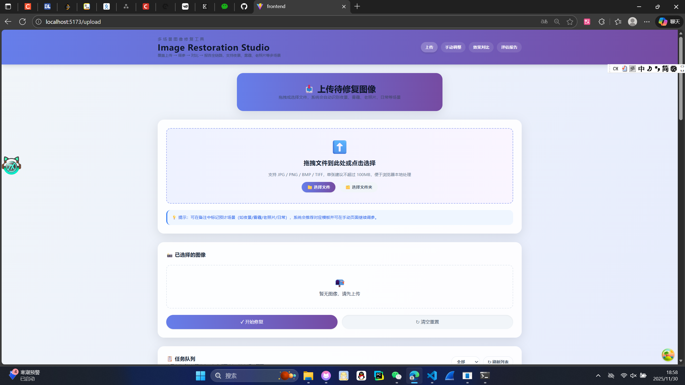
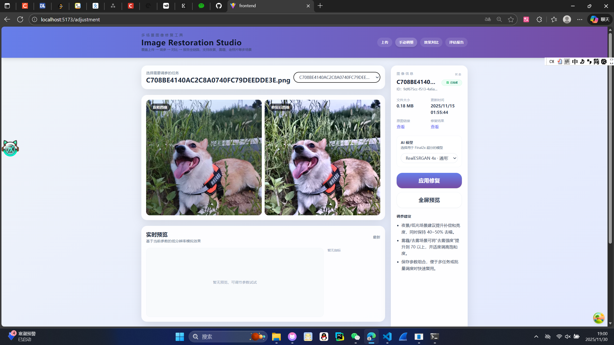
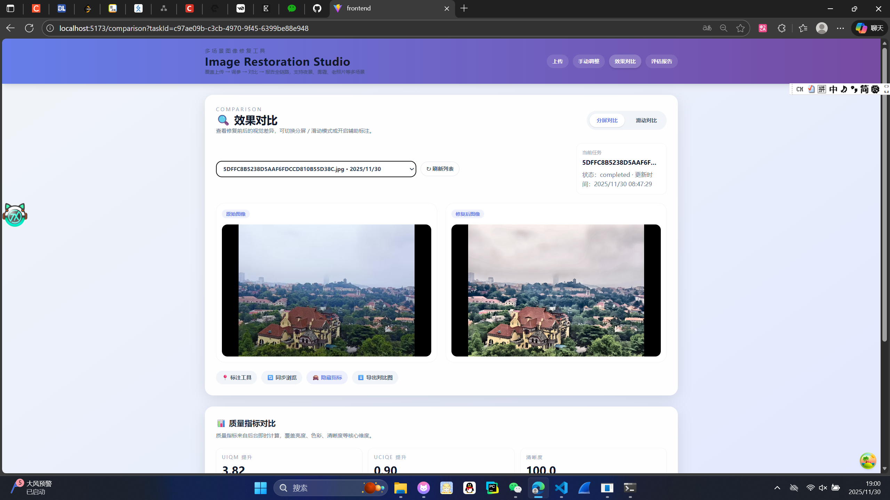
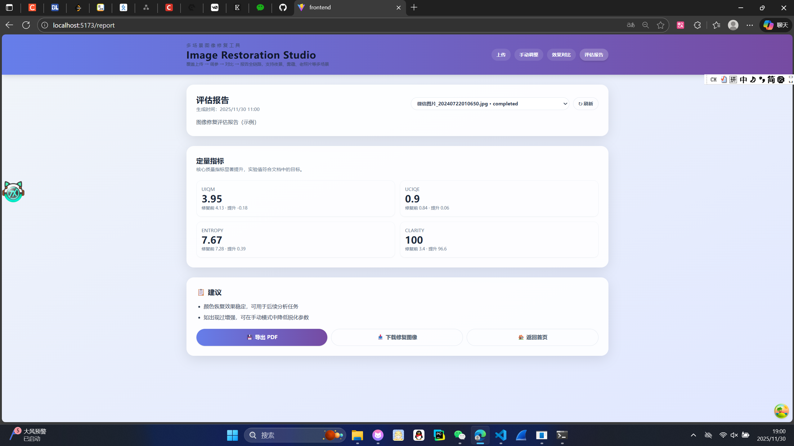

# 第4组 项目 Alpha 阶段周报

**项目阶段：** Alpha
**报告人：** 李曾洋 李东旭
**整体进度：** ~60% （核心流程已贯通）

## 1. 本周工作概要

本周项目整体按计划推进，成功完成了从“上传 → 自动编排 → 手动调参 → 效果对比 → 报告导出”的全链路UI，并可对接后端进行完整流程演示。后端核心服务、任务队列与图像处理管线已搭建完成。主要问题在于虽然Redis部分已经完成但是数据持久化方案尚未落地（主要是这周听了老师讲的数据库选择，第一次了解到可以使用两种数据库，我们修改了原来的计划打算采用Mysql+Redis），且部分核心功能工程化程度不足（我们选的核心处理还是不够好，用的开源模型final2x，虽然能提升设定的指标，但是从肉眼上看感觉有的甚至更差了，下周好好琢磨琢磨）。

## 2. 关键进展与成果

### 2.1 前端核心交互流程贯通

- **关键页面功能：**
    - **上传页：** 实现文件夹递归解析、批量上传与任务队列可视化。
    - **手动调参面板：** 提供状态管理与参数滑块，参数可回填并重新排队。
    - **自动修复编排：** 支持策略选择、强度调整与多任务批量处理。
    - **效果对比与报告：** 实现分屏/擦除等对比模式，报告页可导出建议。
- **统一接口：** 通过统一的API客户端对接FastAPI后端，提升了开发效率。

### 2.2 后端任务处理流水线就绪
- **服务集成：** FastAPI应用成功集成Redis、任务服务、报告服务与后台Worker。
- **异步处理：** 独立的TaskWorker线程能自动从Redis队列消费任务，并进行处理。

## 3. 下周工作计划

1.  **【高优】数据持久化**
    - 完成PostgreSQL（元数据）与MinIO/S3（图像存储）的接入。
    - 提供数据迁移脚本，避免Redis数据丢失。

2.  **【功能完善】参数协议与报告真实化**
    - 统一自动/手动调参的后端参数协议，使策略生效。
    - 改造报告服务，使其读取真实任务指标而非示例数据。

3.  **【核心功能图像修复更加彻底**
    - 好好研究研究final2x是如何使用的。
    - https://zhuanlan.zhihu.com/p/648221215
